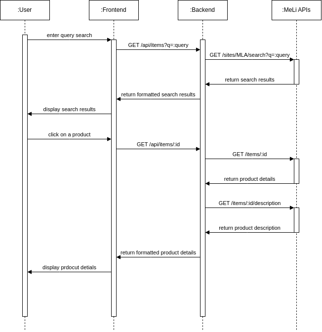
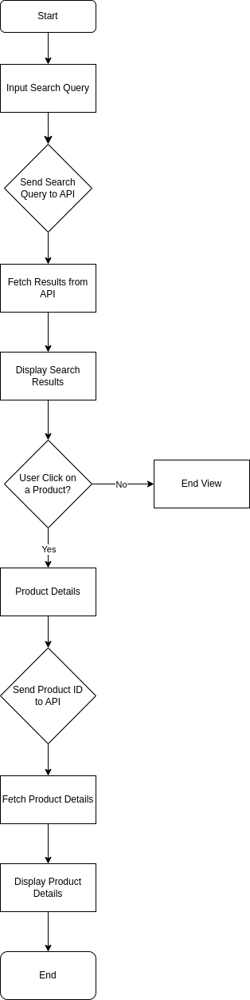

# testing

## Diagrams
### Sequence Diagram
This diagram illustrates the sequence of interactions between the user, frontend, backend, and external APIs.

### Flowchart
This flowchart provides an overview of the application's workflow and how data flows through different components.

## License
This project is licensed under the MIT License.
